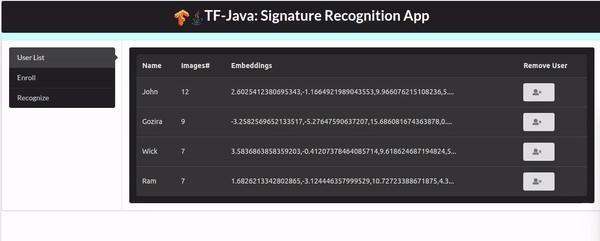
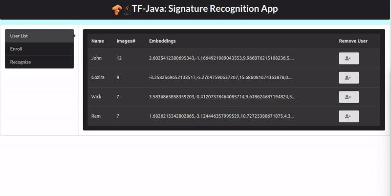

# siamese-tf-java

A Java spring boot application to serve Tensorflow trained siamese model
with React frontend. For illustration purpose, a siamese model trained for 
signature verification ([python code](https://github.com/rmalav15/signature-recognition))
is integrated here. [[Tensorflow Model]](https://drive.google.com/file/d/1JnUSwWPy1iHaFqLR1WRsqfH0yGiLleFs/view?usp=sharing)

**Enrollment**<br/>
 
<br/>

**Recognition**<br/>


## Requirements
* [Java 8](http://www.oracle.com/technetwork/java/javase/overview/index.html) 
* [Apache Maven](https://maven.apache.org/)
* NodeJS


## Getting Started

Download the provided [Tensorflow model](https://drive.google.com/file/d/1JnUSwWPy1iHaFqLR1WRsqfH0yGiLleFs/view?usp=sharing)
and extract it in *src/main/resources*.

To use your own model, first train it using [python code](https://github.com/rmalav15/signature-recognition) (Use its 
graph_serialize_utils to convert it to pb file). Then set appropriate model path in
*src/main/resources/application.properties*. If necessary, implement provided interface
*com.tensorflow.siamese.services.TfModelServingService*.

Then execute following in root directory:
```bash
mvn clean install
mvn spring-boot:run
```

Start front-end:
```bash
cd <webapp folder>
npm run start
```

Then just open [localhost:3000](localhost:3000) in your browser.